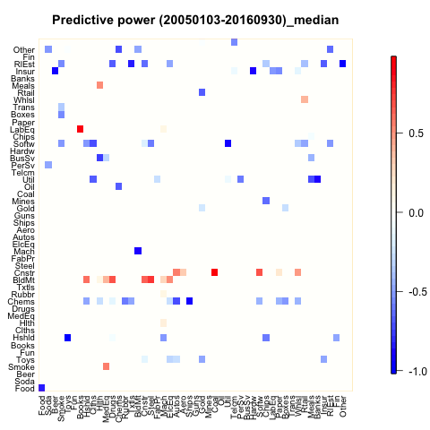
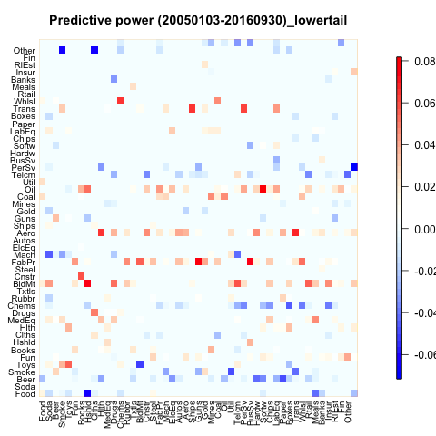
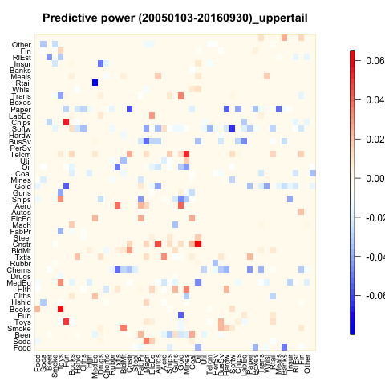

[](http://quantlet.de/)

## [](http://quantlet.de/) **INET-totalconn** [](http://quantlet.de/)

```yaml

Name of QuantLet : INET-totalconn

Published in : Industry Interdependency Dynamics in a Network Context

Description : 'Plot the image maps of the predictive power of 49 USA industries return data under
different stress situations (median, lowertail and uppertail)'

Keywords : interdependency, network, stress situation, predictive power, image plot

Author : Ya Qian

Submitted : Ya Qian

Datafile : industryname.csv, beta_L_median.csv, beta_L_lowertail.csv, beta_L_uppertail.csv

Output : 'Plot the images of the predictive power of industry return data under different stress
situations (median, lowertail and uppertail)'

```








### R Code:
```r
#Close windows and clear variables                                                                   
graphics.off()
rm(list = ls(all=TRUE))

# install and load packages
libraries = c("fields", "graphics")
lapply(libraries, function(x) if (!(x %in% installed.packages())) {
  install.packages(x)})
lapply(libraries, library, quietly = TRUE, character.only = TRUE)

#Read the datafile
datafile = c("beta_L_median.csv", "beta_L_lowertail.csv","beta_L_uppertail.csv")

for (s in 1:length(datafile)){
conn             = read.csv(datafile[s], header = TRUE, sep = ",", dec = ".")
industrynames    = read.csv("industrynames.csv")
rownames(conn)   = industrynames[ ,2]
colnames(conn)   = industrynames[ ,2]
conn             = conn[ ,-1]
data             = data.matrix(conn)
maxvalue         = max(data)
minvalue         = min(data)

  
titles           = c("Predictive power (20050103-20160930)_median",
                    "Predictive power (20050103-20160930)_lowertail",
                    "Predictive power (20050103-20160930)_uppertail")
data             = data.matrix(conn)

#plot the images and save them
savepath         = file.path("/Users/qianya/Library/Mobile Documents/com~apple~CloudDocs/ffdata/output", paste("totalimage_d", s, ".png", sep = "")) 
png(file = savepath)
par(mar=c(3,3,3,6))
image(data, axes = FALSE, main = titles[s])
colorTable       = designer.colors(50, c("blue","white", "red") )
mtext(colnames(data), side = 2, line=0.3, at = seq(0,1,1/48),  las = 2, cex = 0.8)
mtext(colnames(data), side = 1, line=0.3, at = seq(0,1,1/48),  las = 2, cex = 0.8)
image.plot(data, add = TRUE, col = colorTable, legend.cex = 0.1, legend.mar = 3.5, legend.width = 0.5, zlim = c(minvalue,maxvalue))
}

dev.off()
```
